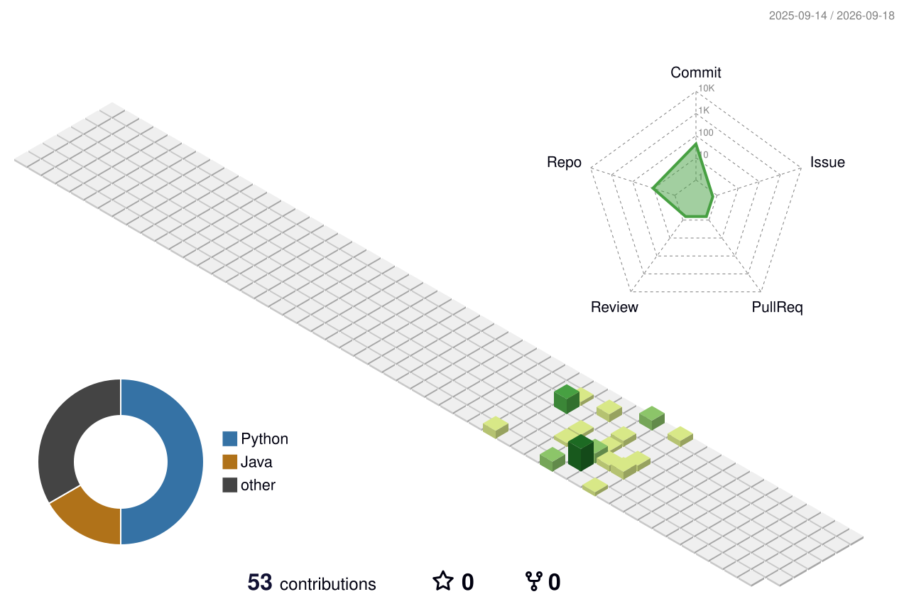

# Hi, I'm Prakhar 👋

## 3D Contribution Graph

<h1 align="center">Hi, I'm Prakhar Khare 👋</h1>
<h3 align="center">GenAI Engineer | Backend Developer</h3>

  Building intelligent backend systems and LLM-powered applications.

---

### 🚀 About Me

- 🔭 I'm currently working on **GenAI applications & backend systems**
- 🧠 Focused on **LLMs, RAG pipelines, and agentic workflows**
- ⚙️ I build scalable APIs and services using **Python & FastAPI**
- 🌱 Always exploring new tools in the LLM/AI ecosystem
- 💬 Ask me about **LangChain, OpenAI APIs, FastAPI, system design**

---

### 🛠️ Tech Stack

**Languages & Frameworks**

**Databases & Tools**

---

### 📊 GitHub Stats

  

  

---

### 📫 Connect with Me

  
  

